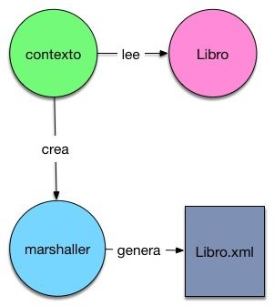
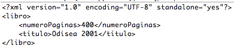

#Introducción a Java JAXB y el manejo de XML 

Java JAXB  o Java XML API Binding nos permite trabajar con XML y JSON de una forma cómoda usando Java.  Vamos a ver una introducción a este estándar y sus anotaciones. Para ello nos  apoyaremos en la clase Libro y  las anotaciones de JAXB:


```
package com.arquitecturajava;
 
import javax.xml.bind.annotation.XmlElement;
import javax.xml.bind.annotation.XmlRootElement;
 
@XmlRootElement
public class Libro {
 
    private String titulo;
     
     
    private int paginas;
     
    public String getTitulo() {
        return titulo;
    }
     
    public Libro(String titulo, int paginas) {
        super();
        this.titulo = titulo;
        this.paginas = paginas;
    }
    public Libro() {
        super();
    }
    public void setTitulo(String titulo) {
        this.titulo = titulo;
    }
    @XmlElement(name="numeroPaginas")
    public int getPaginas() {
        return paginas;
    }
    public void setPaginas(int paginas) {
        this.paginas = paginas;
    }
 
}
```

Hemos añadido dos anotaciones @XmlRootElement que especifica la clase raiz que vamos a convertir a XML . Por otro lado @XmlElement permite cambiar el nombre de los elementos cuando el fichero XML se construya. Es momento de generar el fichero XML .

```
package com.arquitecturajava;
 
import javax.xml.bind.JAXBContext;
import javax.xml.bind.JAXBException;
import javax.xml.bind.Marshaller;
import javax.xml.bind.PropertyException;
 
public class Principal {
 
    public static void main(String[] args) {
     
        try {
            Libro libro= new Libro("Odisea 2001",400);
            JAXBContext contexto = JAXBContext.newInstance(
                    libro.getClass() );
                Marshaller marshaller = contexto.createMarshaller();
                marshaller.setProperty(Marshaller.JAXB_FORMATTED_OUTPUT,
                    Boolean.TRUE);
                marshaller.marshal(libro, System.out);
        } catch (PropertyException e) {
            // TODO Auto-generated catch block
            e.printStackTrace();
        } catch (JAXBException e) {
            // TODO Auto-generated catch block
            e.printStackTrace();
        }
         
 
    }
 
}
```

Disponemos de dos objetos el contexto y el marshaller . El contexto se encarga de definir los objetos de negocio que vamos a utilizar y el marshaller en que forma vamos a generar la estructura.



Si ejecutamos el código veremos un XML en la consola:



La misma operación se puede realizar al contrario , leer un fichero XML y rellenar un objeto Java.

```
package com.arquitecturajava;
 
import java.io.File;
 
import javax.xml.bind.JAXBContext;
import javax.xml.bind.JAXBException;
import javax.xml.bind.Unmarshaller;
 
public class Principal2 {
 
    public static void main(String[] args) {
     
        try {
            JAXBContext context = JAXBContext.newInstance( Libro.class );
            Unmarshaller unmarshaller = context.createUnmarshaller();
            Libro libro = (Libro)unmarshaller.unmarshal(
                new File("src/Libro.xml") );
             
            System.out.println(libro.getTitulo());
            System.out.println(libro.getPaginas());
             
        } catch (JAXBException e) {
            // TODO Auto-generated catch block
            e.printStackTrace();
        }
 
    }
 
}
```

Como vemos trabajar con Java JAXB es sencillo y podremos generar ficheros XML o leerlos de forma inmediata.